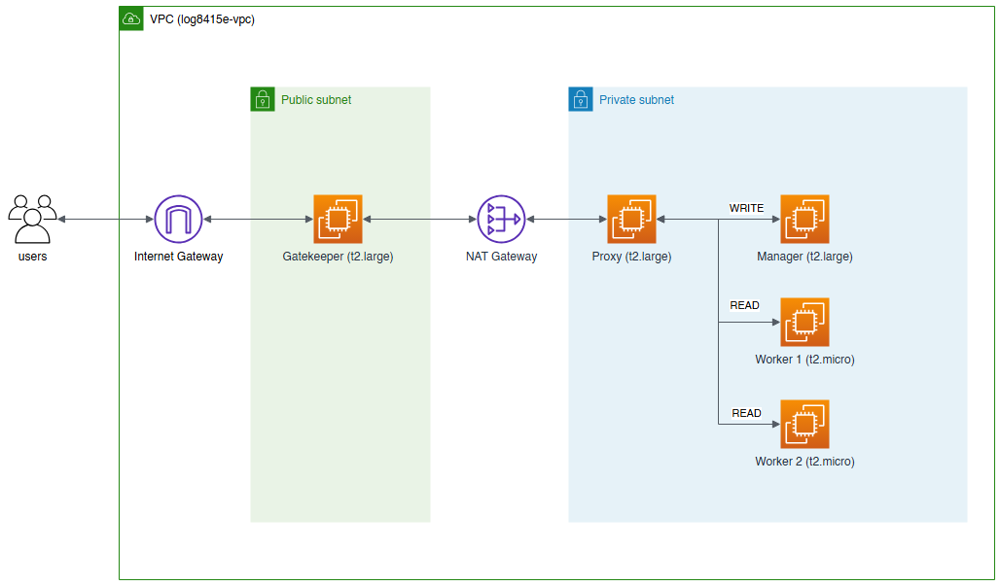
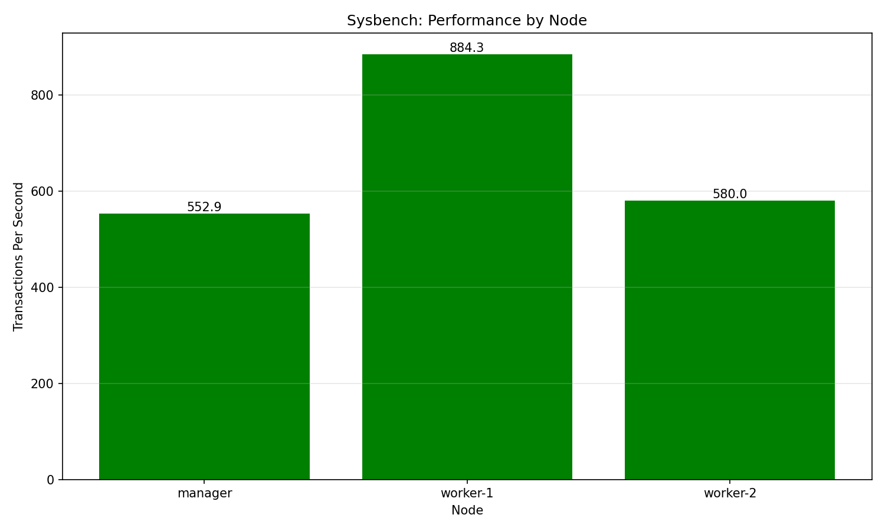
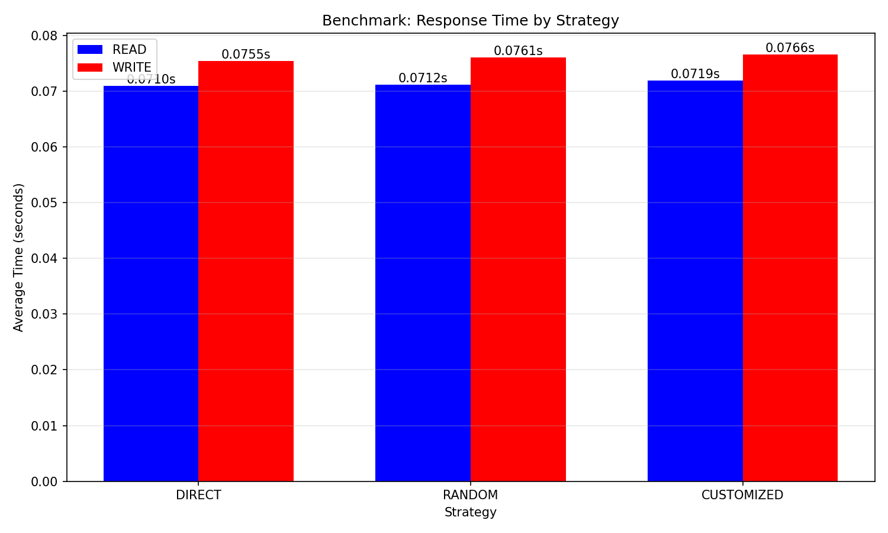

# MySQL Cluster Cloud Patterns

<div align="justify">
This project implements a distributed MySQL database cluster on AWS with integrated security patterns. It demonstrates the implementation of the <strong>Gatekeeper</strong> and <strong>Proxy</strong> cloud design patterns for a secure, scalable database architecture. The system separates read and write operations across multiple nodes, implements defense-in-depth security through network isolation, and provides three distinct forwarding strategies for query routing optimization.
</div>

## Architecture Overview

The architecture consists of a three-tier system organized into public and private subnets:

- **Database Layer**: 3 EC2 t2.micro instances (1 manager + 2 workers) in master-subordinate replication
- **Proxy Layer**: t2.large instance acting as Trusted Host, routing queries based on strategy
- **Gatekeeper Layer**: t2.large internet-facing instance validating all incoming requests



## Features

- ✅ Automated Infrastructure as Code (IaC) using AWS Boto3
- ✅ MySQL master-subordinate replication with Sakila database
- ✅ Three query routing strategies: Direct Hit, Random, Customized
- ✅ API key authentication and SQL injection prevention
- ✅ Network isolation with public/private subnet architecture
- ✅ Automated benchmarking with sysbench and custom tests
- ✅ Comprehensive security group configuration
- ✅ Automated resource cleanup

## Prerequisites

- Python 3.8+
- AWS Account with appropriate permissions
- AWS CLI configured or credentials ready
- Required Python packages (see `requirements.txt`)

## Project Structure

```
.
├── scripts/
│   ├── main.py
│   ├── cleanup.py
│   └── benchmark.py
├── user-data/
│   ├── manager.tpl
│   ├── worker.tpl
│   ├── proxy.tpl
│   └── gatekeeper.tpl
├── results/
│   ├── sysbench_chart.png
│   ├── benchmark_chart.png
│   ├── benchmark_result.txt
│   ├── manager_sysbench_results.txt
│   ├── worker-1_sysbench_results.txt
│   └── worker-2_sysbench_results.txt
├── images/
│   └── lab_setup.png
├── requirements.txt
└── README.md
```

## Installation

### 1. Clone the Repository

```bash
git clone https://github.com/mehdiougadi/mysql-cluster-cloud-patterns.git
cd ./mysql-cluster-cloud-patterns
```

### 2. Install Dependencies

```bash
pip install -r requirements.txt
```

### 3. Configure AWS Credentials

You can either:

**Option A**: Use AWS CLI to configure credentials
```bash
aws configure
```

**Option B**: The script will prompt you for credentials if not found
- AWS Access Key ID
- AWS Secret Access Key
- AWS Session Token (optional)

## Usage

### Running the Complete Deployment

Navigate to the scripts directory and run the main script:

```bash
cd scripts
python main.py
```

### Workflow

The script executes the following workflow automatically:

#### 1. **AWS Credentials Verification**
- Validates existing credentials or prompts for manual entry
- Verifies access using AWS STS
- Sets up Boto3 clients for EC2 operations

#### 2. **Infrastructure Creation**
- Creates VPC with public (10.0.1.0/24) and private (10.0.2.0/24) subnets
- Sets up Internet Gateway for public subnet connectivity
- Deploys NAT Gateway for private subnet internet access
- Configures route tables and associations
- Generates SSH key pair for instance access

#### 3. **MySQL Standalone and Sakila**
- Deploys 1 manager instance (t2.micro) in private subnet
- Deploys 2 worker instances (t2.micro) in private subnet
- Installs MySQL 8.0 on all database nodes
- Downloads and installs Sakila sample database
- Configures master-subordinate replication (manager → workers)
- Runs sysbench benchmarks on each node

#### 4. **Proxy Pattern Implementation**
- Deploys t2.large instance in private subnet as Trusted Host
- Installs Flask API service for query routing
- Implements three forwarding strategies:
  - **Direct Hit**: Routes all queries to manager
  - **Random**: Randomly distributes reads across workers
  - **Customized**: Routes reads to lowest-latency worker (ping-based)
- Configures background health monitoring thread
- Sets up MySQL connections to all database nodes

#### 5. **Gatekeeper Pattern Implementation**
- Deploys t2.large instance in public subnet
- Configures internet-facing Flask API on port 8080
- Implements API key authentication (X-API-Key header)
- Performs SQL query sanitization and validation
- Forwards validated requests to Proxy on port 5000
- Blocks dangerous operations (DROP, DELETE without WHERE, etc.)

#### 6. **Security Group Configuration**
- **Manager/Worker SGs**: MySQL (3306) from private subnet, SSH from public subnet, ICMP for health checks
- **Proxy SG**: API access (5000) from public subnet only, MySQL (3306) to private subnet, ICMP outbound
- **Gatekeeper SG**: HTTP/HTTPS/8080 from internet, port 5000 to private subnet

#### 7. **Benchmarking**
- Collects sysbench results from all database nodes via SSH
- Sends 1000 read + 1000 write requests per strategy through Gatekeeper
- Measures average response times for each forwarding strategy
- Generates visualization charts

#### 8. **Results Visualization**
- Creates bar charts comparing sysbench performance across nodes
- Creates grouped bar charts showing response times by strategy
- Saves results to `results/` directory

#### 9. **Automated Cleanup**
- Waits 2 minutes after benchmarking
- Terminates all EC2 instances
- Deletes NAT Gateway and releases Elastic IP
- Deletes security groups
- Detaches and deletes Internet Gateway
- Deletes subnets and route tables
- Deletes VPC
- Deletes SSH key pair

## Benchmark Results

### Sysbench Performance by Node

The sysbench results show performance variation across identical t2.micro instances:



- **Worker-2**: 878.0 TPS (highest performance)
- **Worker-1**: 858.5 TPS
- **Manager**: 852.1 TPS (lowest due to replication overhead)

### Cluster Response Times by Strategy

All three routing strategies show similar performance with minimal variance:



| Strategy | Read (ms) | Write (ms) |
|----------|-----------|------------|
| Direct | 79.2 | 91.8 |
| Random | 82.3 | 90.6 |
| Customized | 80.9 | 89.3 |

The < 1.5% variance indicates network latency dominates response times rather than database processing.

## API Usage

### Sending Queries to Gatekeeper

```bash
curl -X POST http://<GATEKEEPER_IP>:8080/query \
  -H "Content-Type: application/json" \
  -H "X-API-Key: test-api-key" \
  -d '{
    "query": "SELECT * FROM actor LIMIT 10",
    "strategy": "random"
  }'
```

### Available Strategies
- `direct` - All queries go to manager
- `random` - Reads distributed randomly across workers
- `customized` - Reads routed to lowest-latency worker

### API Key
Default API key is `test-api-key` (configured in Gatekeeper user data)

## Security Considerations

- **Network Isolation**: Database instances have no direct internet access
- **Defense in Depth**: Gatekeeper validates before Proxy routes
- **Minimal Attack Surface**: Only Gatekeeper is internet-facing
- **Input Validation**: SQL injection prevention through regex filtering
- **Authentication**: API key requirement for all requests

## Cleanup

The script automatically cleans up all resources after benchmarking.

## Demo Video

[Watch the video demonstration](https://www.youtube.com/watch?v=EfIxCes5JJg)

## Contributors

- Mehdi Ougadi (2051559)

## Course Information

**Course**: LOG8415E - Advanced Concepts of Cloud Computing  
**Institution**: Polytechnique Montréal  
**Lecturer**: Vahid Majdinasab  
**Date**: December 31, 2025

## License

This project is part of an academic assignment for Polytechnique Montréal.
